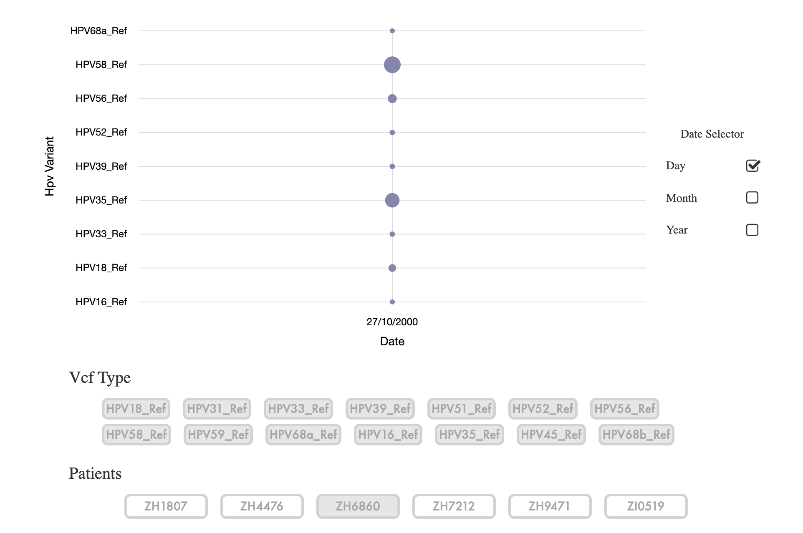

# Viral Profiler

## Description
Application that analyzes sequencing data taken from viral-infected subjects

## Components
1. Pipeline - See [Instructions](https://github.com/DavidStreid/viral-profiler/tree/master/pipeline)
2. [Web Application](http://davidstreid.com/#/data/vcf) - VCF produced by the pipeline can be uploaded and visualized here

