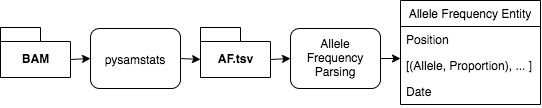

# Viral Profiler Pipeline

## Description


## Run
```
$ $ nextflow ../viral-profiler.nf --bamDir {BAM_DIR}
  N E X T F L O W  ~  version 19.10.0
  Launching `../viral-profiler.nf` [high_bohr] - revision: 88f41f7857
  WARN: The access of `config` object is deprecated
  V I R A L   P R O F I L E R
  ===========================
  INPUT
     fastaFile: {CONFIG FASTA}
     bamDirectory: {BAM_DIR}
  
  executor >  local (2)
  [2d/bdaf3b] process > verifyDependencies [100%] 1 of 1 ✔
  [f9/1b7711] process > getVariations      [  0%] 0 of 1
  [-        ] process > parseVariations    -

```

## Dependencies
* Nextflow
* Python 3
    * [pysamstats](https://www.google.com/search?q=pip+instll+pysamstats&oq=pip+instll+pysamstats&aqs=chrome..69i57j69i59j69i60l2j69i65j69i60l3.2666j0j1&sourceid=chrome&ie=UTF-8)

## Install
```
$ curl https://get.nextflow.io | bash   # Installs nextflow
$ pip install pysamstats
```

